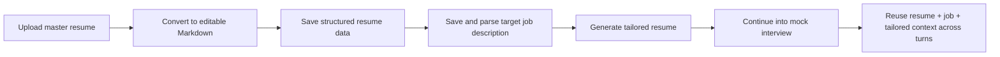

# Career Pilot

Career Pilot 是一个面向求职者的 AI 工作台，重点不是“写一页漂亮的简历”，而是把一条连续工作流真正跑通：

`主简历 -> 可编辑 Markdown -> 目标岗位 JD -> 定制简历 -> 模拟面试`

它的核心目标是减少重复输入和上下文断裂，让用户在修改简历、匹配岗位、生成定制版本、进入面试训练时复用同一份事实来源，而不是在多个孤立页面之间来回切换。

> 当前状态：MVP 持续开发中。主链路已落地，部分页面仍是占位或保留范围。

## 为什么是这个项目

很多求职产品把这些环节拆成彼此独立的工具：

- 简历解析只负责“上传并存档”
- JD 分析只输出一次性建议
- 面试练习要求用户重新输入背景

Career Pilot 的选择不同：

- 主简历会沉淀为可继续编辑和复用的 Markdown
- 目标岗位会被保存并解析成后续流程的上下文
- 定制简历不是一次性文本，而是可下载、可重试、可继续进入面试的工作产物
- 模拟面试直接继承岗位、简历和优化结果，不要求用户重复整理材料

## 核心工作流



## 当前已实现

| 模块     | 当前能力                                                          |
| -------- | ----------------------------------------------------------------- |
| 认证     | 注册、登录、登出、当前用户信息                                    |
| 主简历   | PDF 上传、对象存储、解析状态、Markdown 沉淀、结构化保存           |
| 岗位 JD  | 创建、更新、解析、状态跟踪                                        |
| 定制简历 | 基于已保存的简历 + JD 触发生成、轮询状态、失败重试、Markdown 下载 |
| 模拟面试 | 创建会话、准备首题、提交回答、继续多轮、结束、删除、重试          |
| 运行保障 | 健康检查、readiness、版本信息、统一错误响应                       |

## 当前明确不写成“已完成”的内容

以下方向在仓库中要么是占位、要么明确不在当前范围，不应被误读为已交付能力：

- 设置页、投递追踪页等完整产品化页面
- 语音、音频、实时口语面试模式
- 为了“平台化”而做的广义多 agent 架构扩展
- 与求职申请追踪强耦合的大而全系统

## 技术栈

### Frontend

- Next.js 16
- React 19
- TypeScript
- Tailwind CSS 4
- shadcn/ui + Radix primitives

### Backend

- FastAPI
- SQLAlchemy
- Alembic
- PostgreSQL
- Redis
- MinIO

### AI / Document Processing

- PyMuPDF / `pymupdf4llm`
- OpenAI-compatible provider adapters
- `codex2gpt`、Ollama 等可替换模型入口

## 仓库结构

```text
career-pilot/
├── apps/
│   ├── frontend/      # Next.js 工作台
│   ├── backend/       # FastAPI API、服务、模型、迁移
│   └── miniprogram/   # 小程序入口（当前不是主线）
├── packages/
│   ├── contracts/     # 工作流契约与领域边界
│   ├── api-client/    # 共享 API 客户端基础层
│   └── configs/       # 共享 TypeScript / ESLint 配置
├── docs/              # 持久化文档入口
├── .agents/           # repo-local Codex skills / plans
├── references/        # 参考资产，不是产品源码
├── docker-compose.yml
└── AGENTS.md
```

如果你是第一次进仓库，推荐阅读顺序：

1. `AGENTS.md`
2. `docs/index.md`
3. `docs/product/overview.md`
4. `docs/architecture/system-map.md`
5. `packages/contracts/*`

## Quick Start

### 0. 前置依赖

推荐至少具备：

- Docker + Docker Compose
- Node.js 20
- Python 3.11
- `uv`

### 1. 准备环境变量

```bash
cp .env.example .env
cp apps/backend/.env.example apps/backend/.env
cp apps/frontend/.env.example apps/frontend/.env.local
```

### 2. 启动依赖服务

```bash
docker compose up -d postgres redis minio
```

### 3A. 推荐方式：Docker 启动完整开发环境

```bash
docker compose up --build frontend backend
```

访问地址：

- Frontend: `http://localhost:3000`
- Backend API: `http://localhost:8000`
- MinIO API: `http://localhost:9000`
- MinIO Console: `http://localhost:9001`

### 3B. 可选方式：本地分别启动前后端

后端：

```bash
cd apps/backend
uv sync
uv run alembic upgrade head
uv run uvicorn app.main:app --reload --port 8000
```

前端：

```bash
cd apps/frontend
npm ci
npm run dev
```

## AI Provider 配置

Career Pilot 的核心链路依赖模型能力；如果没有配置可用 provider，简历解析增强、定制简历生成和模拟面试都无法完整工作。

默认示例使用 `codex2gpt`：

```env
RESUME_AI_PROVIDER=codex2gpt
RESUME_AI_BASE_URL=http://127.0.0.1:18100/v1
RESUME_AI_API_KEY=
RESUME_AI_MODEL=gpt-5.4

MATCH_AI_PROVIDER=codex2gpt
MATCH_AI_BASE_URL=http://127.0.0.1:18100/v1
MATCH_AI_API_KEY=
MATCH_AI_MODEL=gpt-5.4

INTERVIEW_AI_PROVIDER=codex2gpt
INTERVIEW_AI_BASE_URL=http://127.0.0.1:18100/v1
INTERVIEW_AI_API_KEY=
INTERVIEW_AI_MODEL=gpt-5.4
```

也支持本地 Ollama 作为备用或降级链路的一部分：

```env
RESUME_PDF_AI_SECONDARY_PROVIDER=ollama
RESUME_PDF_AI_SECONDARY_BASE_URL=http://127.0.0.1:11434
RESUME_PDF_AI_SECONDARY_API_KEY=
RESUME_PDF_AI_SECONDARY_MODEL=qwen2.5:7b
```

完整变量请查看：

- `apps/backend/.env.example`
- `apps/frontend/.env.example`
- `.env.example`

## 关键 API 面

当前后端的主要路由分组如下：

- `/auth`: 注册、登录、登出、当前用户
- `/resumes`: 简历上传、列表、详情、重试解析、结构化保存
- `/jobs`: JD 创建、更新、列表、详情
- `/tailored-resumes`: PDF 转 Markdown、定制简历工作流、重试、下载、事件记录
- `/mock-interviews`: 会话创建、列表、详情、答题、重试准备、结束、删除
- `/health`: 健康检查、readiness、版本

## 文档入口

README 只负责把你快速带到正确位置；更细的产品和结构文档在这里：

- `docs/index.md`: 文档总导航
- `docs/product/overview.md`: 产品目标、范围和边界
- `docs/architecture/system-map.md`: 前后端、存储、AI 与异步流程地图
- `docs/domain/resume-pipeline.md`: 从主简历到模拟面试的连续工作流
- `packages/contracts/README.md`: 共享契约的入口说明

## 开发约定

如果你要继续在这个仓库里开发，先读这些规则：

- 根级规则：`AGENTS.md`
- 前端规则：`apps/frontend/AGENTS.md`
- 后端规则：`apps/backend/AGENTS.md`

仓库的默认工程原则是：

- 优先复用成熟方案，而不是重复造轮子
- 严格保持“简历 -> JD -> 定制简历 -> 面试”的连续工作流
- 一次只交付一个清晰的 MVP feature point
- 不把保留页、占位页和未来规划包装成已完成能力

## License

本项目采用 [Apache License 2.0](./LICENSE)。
