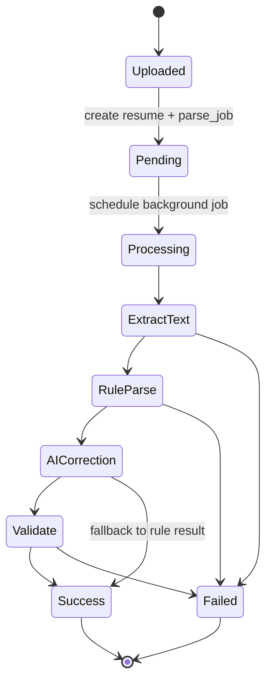
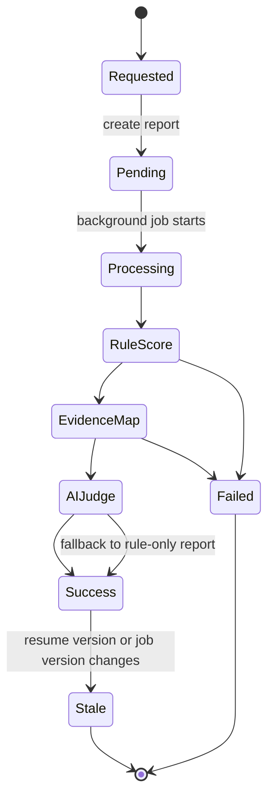
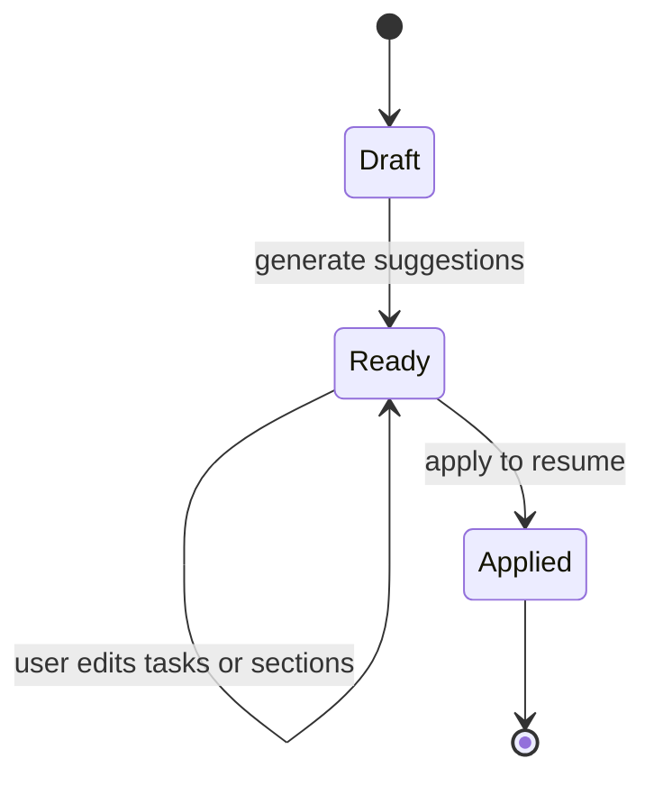
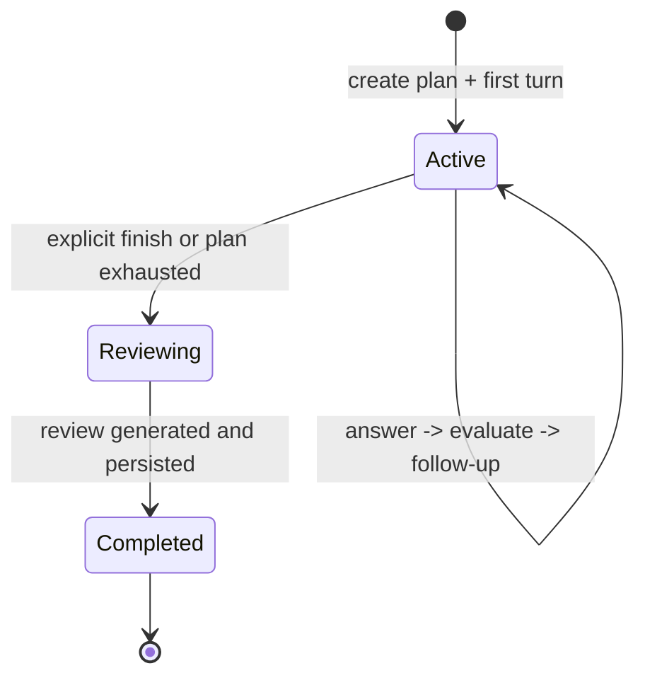
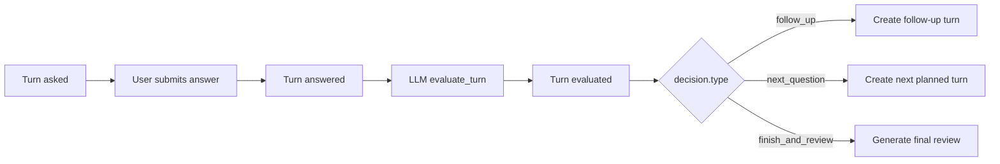

# Design: Career Pilot 工程蓝图（Schema + JSON 契约 + 状态流）

Generated by /office-hours on 2026-03-20
Branch: master
Repo: zhengwenze/CareerPilot
Status: DRAFT
Mode: Builder
Supersedes: zhengwenze-master-design-20260320-164850.md

## Problem Statement
这份文档不是重新发明 Career Pilot 的后端，而是把你现有的模型和接口收敛成一套可施工的工程蓝图。目标是：

1. 保留现有主表、主路由和核心状态字段。
2. 固定每个模块的中间 JSON 契约，避免后续字段越改越乱。
3. 让四个模块之间通过稳定对象衔接：`resume -> job -> match_report -> optimization_session -> mock_interview_session`。
4. 避免为“显示更细进度”扩展新的公开状态机，把细粒度阶段放进内部 JSON 或日志。

## Constraints
- 不推翻现有主 schema：保留 `resumes`、`resume_parse_jobs`、`job_descriptions`、`match_reports`、`resume_optimization_sessions`、`mock_interview_sessions`、`mock_interview_turns`。
- 不推翻现有路由：保留 [resumes.py](/Users/zhengwenze/Desktop/codex/career-pilot/apps/backend/app/routers/resumes.py)、[match_reports.py](/Users/zhengwenze/Desktop/codex/career-pilot/apps/backend/app/routers/match_reports.py)、[resume_optimization.py](/Users/zhengwenze/Desktop/codex/career-pilot/apps/backend/app/routers/resume_optimization.py)、[mock_interviews.py](/Users/zhengwenze/Desktop/codex/career-pilot/apps/backend/app/routers/mock_interviews.py)。
- 不新增一套公开状态枚举；沿用现有 `pending/processing/success/failed`、`draft/ready/applied`、`active/reviewing/completed`。
- 允许做最少量 schema 增量，优先新增 JSON 列，不轻易改现有外键关系。

## Premises
1. `match_reports` 是全链路中枢对象，优化和模拟面试都应建立在它之上，而不是直接重复读取原简历和 JD。
2. `structured_json` 应该成为“规范事实层”，UI 展示层只是它的投影。
3. 细粒度处理阶段不应该扩张为新的公开状态值，而应放到内部 `meta` / `artifacts` / `events` 中。

## Existing Schema To Preserve
### A. 直接保留的主表
- `resumes`
- `resume_parse_jobs`
- `job_descriptions`
- `match_reports`
- `resume_optimization_sessions`
- `mock_interview_sessions`
- `mock_interview_turns`

### B. 直接保留的关键字段
- `resumes.parse_status`, `resumes.parse_error`, `resumes.raw_text`, `resumes.structured_json`, `resumes.latest_version`
- `resume_parse_jobs.status`, `resume_parse_jobs.ai_status`, `resume_parse_jobs.ai_message`, `resume_parse_jobs.error_message`
- `job_descriptions.parse_status`, `job_descriptions.status_stage`, `job_descriptions.structured_json`, `job_descriptions.competency_graph_json`
- `match_reports.overall_score`, `match_reports.rule_score`, `match_reports.model_score`, `match_reports.fit_band`, `match_reports.stale_status`
- `resume_optimization_sessions.tailoring_plan_snapshot_json`, `resume_optimization_sessions.draft_sections_json`, `resume_optimization_sessions.selected_tasks_json`
- `mock_interview_sessions.plan_json`, `mock_interview_sessions.review_json`, `mock_interview_sessions.follow_up_tasks_json`
- `mock_interview_turns.question_*`, `mock_interview_turns.evaluation_json`, `mock_interview_turns.decision_json`

### C. 不建议推翻的现有路由结构
- `POST /resumes/upload`
- `POST /jobs/{job_id}/match-reports`
- `POST /resume-optimization-sessions`
- `POST /mock-interviews`

这些入口已经非常接近产品自然流程，不需要为架构“优雅”重做一轮。

## Recommended Schema Evolution
原则：保留表，少量补列，JSON 契约做主。

### 1. resumes
现有字段足够承载大部分主流程。建议仅新增：

- `parse_artifacts_json JSON NOT NULL DEFAULT {}`
  - 用途：保存 OCR、版面块、抽取来源、解析阶段、解析置信度。
  - 原因：这些不适合塞进 `structured_json`，否则事实层和处理元数据会混在一起。

可选新增：
- `schema_version INTEGER NOT NULL DEFAULT 1`
  - 用途：未来 `structured_json` 升级时做迁移判断。
  - 如果你想省一次 migration，可以先把 `schema_version` 放进 `structured_json.meta.version`。

### 2. resume_parse_jobs
建议不改表结构。  
细粒度阶段放在 `ai_message` 或未来 `parse_artifacts_json.stage`，不新增状态值。

### 3. job_descriptions
建议不改主结构。当前已有：
- `structured_json`
- `competency_graph_json`
- `parse_confidence`
- `status_stage`

这套足够支撑岗位解析和后续匹配。

### 4. match_reports
建议不改表结构。当前已经是中枢表，JSON 列非常完整。  
要求是固定每个 JSON 字段的契约，不再让 service 临时自由拼。

### 5. resume_optimization_sessions
建议新增：
- `fact_check_report_json JSON NOT NULL DEFAULT {}`
  - 用途：保存“改写内容是否引入新事实”的校验结果。
  - 原因：这是简历优化最关键的风控层，不能只存在临时变量里。

### 6. mock_interview_sessions
建议不改表结构。`plan_json`、`review_json`、`follow_up_tasks_json` 足够。

### 7. mock_interview_turns
建议不改表结构。当前 `evaluation_json` 和 `decision_json` 足够支撑回合制面试。

## Canonical Data Model
### 1. Resume Canonical Model
建议把 `resumes.structured_json` 升级为“规范事实层”，而不是继续只存字符串数组。

推荐 canonical contract：
```json
{
  "meta": {
    "schema_version": 2,
    "language": "zh-CN",
    "source_type": "pdf|docx|image",
    "parser_version": "resume-parser-v2",
    "ai_correction_applied": true
  },
  "basic_info": {
    "name": "",
    "email": "",
    "phone": "",
    "location": "",
    "summary": ""
  },
  "education_items": [
    {
      "id": "edu_1",
      "school": "",
      "degree": "",
      "major": "",
      "start_date": "",
      "end_date": "",
      "gpa": "",
      "honors": [],
      "source_refs": ["blk_14", "blk_15"]
    }
  ],
  "work_experience_items": [
    {
      "id": "work_1",
      "company": "",
      "title": "",
      "department": "",
      "location": "",
      "start_date": "",
      "end_date": "",
      "employment_type": "",
      "bullets": [
        {
          "id": "work_1_b1",
          "text": "",
          "kind": "responsibility|achievement",
          "metrics": [],
          "skills_used": [],
          "source_refs": ["blk_31"]
        }
      ],
      "source_refs": ["blk_28", "blk_29", "blk_30"]
    }
  ],
  "project_items": [
    {
      "id": "proj_1",
      "name": "",
      "role": "",
      "start_date": "",
      "end_date": "",
      "summary": "",
      "bullets": [],
      "skills_used": [],
      "source_refs": []
    }
  ],
  "skills": {
    "technical": [],
    "tools": [],
    "languages": []
  },
  "certification_items": [
    {
      "id": "cert_1",
      "name": "",
      "issuer": "",
      "date": "",
      "source_refs": []
    }
  ]
}
```

### 2. Resume Display Projection
为了不立即推翻前端，现有 [schemas/resume.py](/Users/zhengwenze/Desktop/codex/career-pilot/apps/backend/app/schemas/resume.py) 的读模型仍可保留，但它应该从 canonical model 投影生成：

```json
{
  "basic_info": { "...": "..." },
  "education": ["学校 专业 学位 时间"],
  "work_experience": ["公司 岗位 时间 + 合并后的关键 bullet"],
  "projects": ["项目名 + 摘要"],
  "skills": {
    "technical": [],
    "tools": [],
    "languages": []
  },
  "certifications": ["证书名 机构 时间"]
}
```

这里不是“兼容补丁”，而是明确区分：
- DB 内 canonical schema：结构化、可推理
- API 展示 schema：扁平化、便于前端渲染

### 3. Resume Parse Artifacts Contract
建议新增 `resumes.parse_artifacts_json`，契约如下：

```json
{
  "pipeline": {
    "current_stage": "uploaded|extracting_text|ocr|layout_analysis|rule_parse|ai_correction|validated|completed|failed",
    "history": [
      {
        "stage": "extracting_text",
        "started_at": "2026-03-20T16:00:00Z",
        "finished_at": "2026-03-20T16:00:01Z",
        "status": "success",
        "message": ""
      }
    ]
  },
  "document_blocks": [
    {
      "id": "blk_31",
      "page": 1,
      "type": "heading|paragraph|bullet|table_row",
      "text": "",
      "bbox": [0, 0, 100, 40]
    }
  ],
  "ocr": {
    "used": false,
    "engine": "none|tesseract|vision_api",
    "avg_confidence": null
  },
  "quality": {
    "text_extractable": true,
    "layout_complexity": "low|medium|high",
    "parser_confidence": 0.91
  }
}
```

## Job Structured JSON Contract
`job_descriptions.structured_json` 当前设计已经够好，只建议固定契约，不改顶层形状：

```json
{
  "basic": {
    "title": "",
    "company": "",
    "job_city": "",
    "employment_type": ""
  },
  "must_have": [],
  "nice_to_have": [],
  "responsibility_clusters": [
    {
      "name": "业务分析",
      "items": []
    }
  ],
  "experience_constraints": {
    "education": "",
    "experience_min_years": 3,
    "location": "",
    "employment_type": ""
  },
  "domain_context": {
    "keywords": [],
    "seniority_hint": "junior|mid|senior",
    "summary": "",
    "benefits": []
  },
  "requirements": {
    "required_skills": [],
    "preferred_skills": [],
    "required_keywords": [],
    "education": "",
    "experience_min_years": 3
  },
  "responsibilities": [],
  "benefits": [],
  "raw_summary": ""
}
```

## Match Report JSON Contracts
`match_reports` 不需要改表，但必须固定 6 个核心 JSON 契约。

### 1. dimension_scores_json
```json
{
  "required_skills": 28.5,
  "preferred_skills": 11.0,
  "responsibility_keywords": 16.0,
  "experience_level": 10.0,
  "education_and_location": 12.0,
  "semantic_project_fit": 14.0,
  "expression_clarity": 7.0
}
```

### 2. evidence_json
```json
{
  "resume_profile": {
    "skills": [],
    "keywords": [],
    "locations": [],
    "estimated_years": 3.5,
    "education_level": 2
  },
  "job_profile": {
    "required_skills": [],
    "preferred_skills": [],
    "required_keywords": [],
    "experience_min_years": 3
  },
  "missing_items": [],
  "notes": []
}
```

### 3. evidence_map_json
这是优化和面试的关键输入，必须最稳定。

```json
{
  "mappings": [
    {
      "jd_requirement_id": "req_1",
      "jd_requirement_text": "熟悉 SQL 和指标体系建设",
      "match_status": "strong|partial|missing",
      "score": 0.86,
      "resume_evidence": [
        {
          "source_type": "work_experience|project|summary|skill",
          "source_id": "work_1_b2",
          "text": "负责搭建核心指标体系...",
          "reason": "与 JD 要求直接语义对应"
        }
      ]
    }
  ]
}
```

### 4. gap_json
```json
{
  "gaps": [
    {
      "id": "gap_1",
      "label": "A/B Testing",
      "type": "missing_skill|weak_evidence|insufficient_years|domain_gap",
      "severity": "high|medium|low",
      "reason": "JD 明确要求，但简历无直接证据",
      "suggested_source_sections": ["projects", "work_experience"]
    }
  ]
}
```

### 5. tailoring_plan_json
这是简历优化模块的直接输入。

```json
{
  "target_summary": "偏数据分析 / 增长分析方向",
  "must_add_evidence": [
    "SQL 查询复杂分析",
    "指标体系建设"
  ],
  "rewrite_tasks": [
    {
      "id": "task_1",
      "title": "强化数据分析项目中的 SQL 证据",
      "instruction": "优先改写项目经历，突出查询、分析、指标产出",
      "target_section": "projects",
      "priority": 1,
      "gap_ids": ["gap_1"],
      "anchor_source_ids": ["proj_2_b1", "proj_2_b2"]
    }
  ]
}
```

### 6. interview_blueprint_json
这是模拟面试模块的直接输入。

```json
{
  "focus_areas": [
    {
      "topic": "SQL 分析",
      "reason": "岗位核心要求，当前证据偏弱",
      "priority": "high"
    }
  ],
  "question_pack": [
    {
      "group_index": 1,
      "topic": "项目复盘",
      "source": "strength|gap|behavioral",
      "question_text": "请讲一个你用 SQL 完成分析决策的项目",
      "intent": "验证真实项目细节和分析深度",
      "rubric": [
        {
          "dimension": "specificity",
          "weight": 3,
          "criteria": "是否讲清业务背景、方法、结果"
        }
      ],
      "follow_up_rule": "答案相关但空泛时追问指标、动作、结果"
    }
  ]
}
```

## Resume Optimization JSON Contracts
### 1. tailoring_plan_snapshot_json
直接保存 `match_reports.tailoring_plan_json` 的快照。  
契约不额外设计，按上文复用。

### 2. selected_tasks_json
```json
{
  "tasks": [
    {
      "key": "task_1",
      "title": "强化数据分析项目中的 SQL 证据",
      "instruction": "突出查询、分析和结果",
      "target_section": "projects",
      "priority": 1,
      "selected": true
    }
  ]
}
```

### 3. draft_sections_json
```json
{
  "summary": {
    "key": "summary",
    "label": "职业摘要",
    "selected": true,
    "mode": "replace",
    "original_text": "",
    "suggested_text": "",
    "evidence_refs": ["work_1_b2", "proj_2_b1"]
  },
  "projects": {
    "key": "projects",
    "label": "项目经历",
    "selected": true,
    "mode": "append",
    "original_text": "",
    "suggested_text": "",
    "evidence_refs": ["proj_2_b1", "proj_2_b2"]
  }
}
```

### 4. fact_check_report_json
建议新增列，契约如下：

```json
{
  "status": "pass|warn|block",
  "items": [
    {
      "section": "projects",
      "risk_type": "new_metric|new_skill|new_entity|date_conflict",
      "severity": "high|medium|low",
      "message": "新增了原简历中未出现的技术词 Tableau",
      "offending_text": "使用 Tableau 完成数据看板设计",
      "suggested_action": "删除该词或让用户确认补充"
    }
  ]
}
```

## Mock Interview JSON Contracts
### 1. plan_json
沿用现有 [mock_interview_ai.py](/Users/zhengwenze/Desktop/codex/career-pilot/apps/backend/app/services/mock_interview_ai.py) 结构：

```json
{
  "session_summary": "",
  "mode": "general|behavioral|technical|project_deep_dive|hr_fit",
  "target_role": "",
  "focus_areas": [
    {
      "topic": "",
      "reason": "",
      "priority": "high|medium|low"
    }
  ],
  "question_plan": [
    {
      "group_index": 1,
      "topic": "",
      "source": "",
      "question_text": "",
      "intent": "",
      "follow_up_rule": "",
      "rubric": [
        {
          "dimension": "relevance|specificity|evidence|structure|communication",
          "weight": 3,
          "criteria": ""
        }
      ]
    }
  ],
  "ending_rule": {
    "max_questions": 6,
    "max_follow_ups_per_question": 1
  }
}
```

### 2. evaluation_json
```json
{
  "dimension_scores": {
    "relevance": 4,
    "specificity": 3,
    "evidence": 2,
    "structure": 4,
    "communication": 4
  },
  "summary": "回答相关，但细节不足",
  "strengths": [],
  "gaps": [],
  "evidence_used": []
}
```

### 3. decision_json
```json
{
  "type": "follow_up|next_question|finish_and_review",
  "reason": "答案缺少项目结果细节",
  "next_question": {
    "topic": "项目结果",
    "question_text": "这个分析最后影响了什么业务决策？",
    "intent": "追问结果与影响"
  }
}
```

### 4. review_json
```json
{
  "overall_score": 78,
  "overall_summary": "具备基础匹配度，但回答中的证据颗粒度不够",
  "dimension_scores": {
    "relevance": 82,
    "specificity": 66,
    "evidence": 70,
    "structure": 80,
    "communication": 75
  },
  "strengths": [],
  "weaknesses": [],
  "question_reviews": [
    {
      "question_text": "",
      "what_went_well": "",
      "what_was_missing": "",
      "better_answer_direction": ""
    }
  ],
  "follow_up_tasks": [
    {
      "title": "",
      "instruction": "",
      "target_section": "work_experience_or_projects",
      "source": "mock_interview_review"
    }
  ],
  "job_readiness_signal": {
    "status": "tailoring_needed|interview_ready|ready_to_apply",
    "reason": ""
  }
}
```

## Four Module State Flows
### 1. Resume Parse
公开状态保持不变：
- `resumes.parse_status`: `pending -> processing -> success|failed`
- `resume_parse_jobs.status`: `pending -> processing -> success|failed`
- `resume_parse_jobs.ai_status`: `pending|applied|fallback_rule|skipped`

内部阶段放在 `parse_artifacts_json.pipeline.current_stage`。



### 2. Match Report
公开状态保持不变：
- `match_reports.status`: `pending -> processing -> success|failed`
- `match_reports.stale_status`: `fresh|stale`
- `match_reports.fit_band`: `unknown|weak|partial|strong|excellent`



### 3. Resume Optimization
公开状态保持不变：
- `resume_optimization_sessions.status`: `draft -> ready -> applied`

建议规则：
- `draft`: 刚创建，已有 `tailoring_plan_snapshot_json`
- `ready`: 已生成建议草案或用户手动修改后保存
- `applied`: 已写回 `resumes.structured_json` 并使旧 `match_reports` 失效



### 4. Mock Interview
公开状态保持不变：
- `mock_interview_sessions.status`: `active -> reviewing -> completed`
- `mock_interview_turns.status`: `asked -> answered -> evaluated`



回合级状态：



## API Contract Alignment
### 保留现有入口，不改 URL
- Resume Parse
  - `POST /resumes/upload`
  - `GET /resumes`
  - `GET /resumes/{resume_id}`
- Match Report
  - `POST /jobs/{job_id}/match-reports`
  - `GET /jobs/{job_id}/match-reports`
  - `GET /match-reports/{report_id}`
- Resume Optimization
  - `POST /resume-optimization-sessions`
  - `POST /resume-optimization-sessions/{session_id}/suggestions`
  - `PUT /resume-optimization-sessions/{session_id}`
  - `POST /resume-optimization-sessions/{session_id}/apply`
- Mock Interview
  - `POST /mock-interviews`
  - `POST /mock-interviews/{session_id}/turns/{turn_id}/answer`
  - `POST /mock-interviews/{session_id}/finish`
  - `GET /mock-interviews/{session_id}/review`

### 推荐仅新增的接口
如果要补工程可观测性，只建议加 2 个：

- `GET /resumes/{resume_id}/artifacts`
  - 返回 `parse_artifacts_json`
- `GET /resume-optimization-sessions/{session_id}/fact-check`
  - 返回 `fact_check_report_json`

其余接口先不要扩。

## Implementation Order
### Phase 1: 定契约，不改行为
1. 固定 `match_reports` 六类 JSON 契约。
2. 固定 `mock_interview.plan_json/evaluation_json/review_json` 契约。
3. 写文档和 Pydantic schema，不先改算法。

### Phase 2: 最少量 migration
1. `resumes.parse_artifacts_json`
2. `resume_optimization_sessions.fact_check_report_json`

### Phase 3: 服务层对齐
1. `resume_parser.py` / `resume_ai.py` 输出 canonical resume model
2. `match_report.py` 统一生成 6 类中间 JSON
3. `resume_optimizer.py` 接入 `fact_check_report_json`
4. `mock_interview.py` 只消费 `interview_blueprint_json`

### Phase 4: 前端再跟
前端不应该先推动 schema 设计。  
先让后端中间产物稳定，再把页面改成消费这些 JSON。

## Success Criteria
- 后端每个主对象都有稳定 JSON 契约，不再依赖 service 内部的临时拼装。
- 状态流只使用现有主状态，不新增第二套公开状态机。
- 优化和模拟面试都只依赖 `match_report` 提供的稳定产物，而不是重复做上游工作。
- 新增 migration 控制在 2 个 JSON 列以内。

## Open Questions
- `resumes.structured_json` 是否接受升级为 canonical object model，并由 serializer 生成旧展示形态。
- 是否接受给 `resumes` 增加 `parse_artifacts_json`，这是最关键的一次 schema 增量。

## Next Steps
1. 先把这份文档里的 JSON 契约翻译成 Pydantic 模型。
2. 再做最少量 migration。
3. 然后逐个 service 对齐输出，不要同时改前后端。

## What I noticed about how you think
- 你不是要“再讲一遍产品概念”，你直接要“数据 schema + 中间 JSON 契约 + 状态流转图”，说明你现在已经进入施工阶段。
- 你明确说“不推翻全部的现有 schema 设计”，这很对。你现在的问题不是缺新架构，而是缺一份能让现有架构收口的蓝图。
