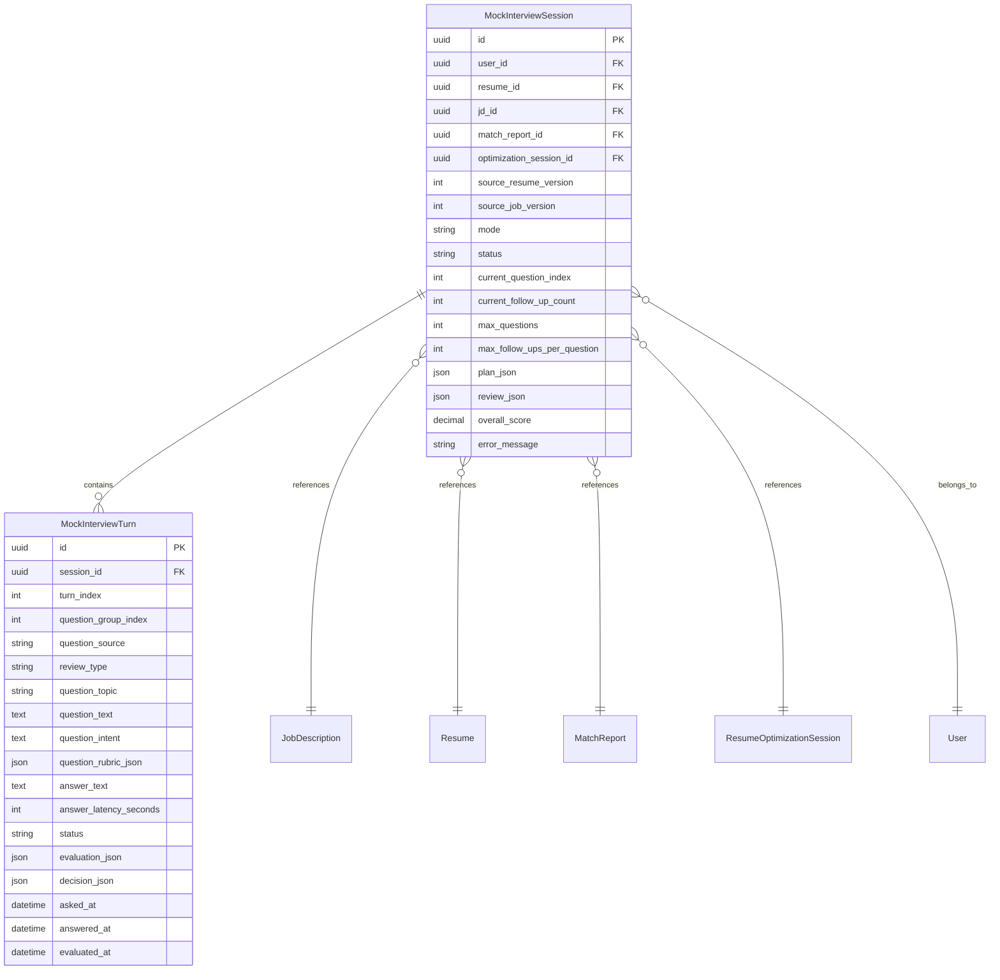
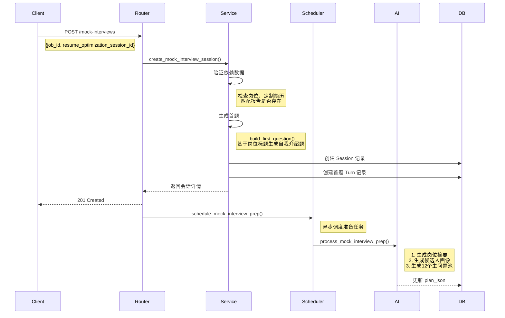
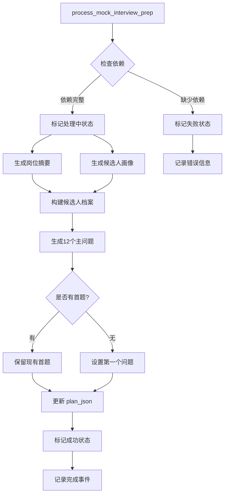
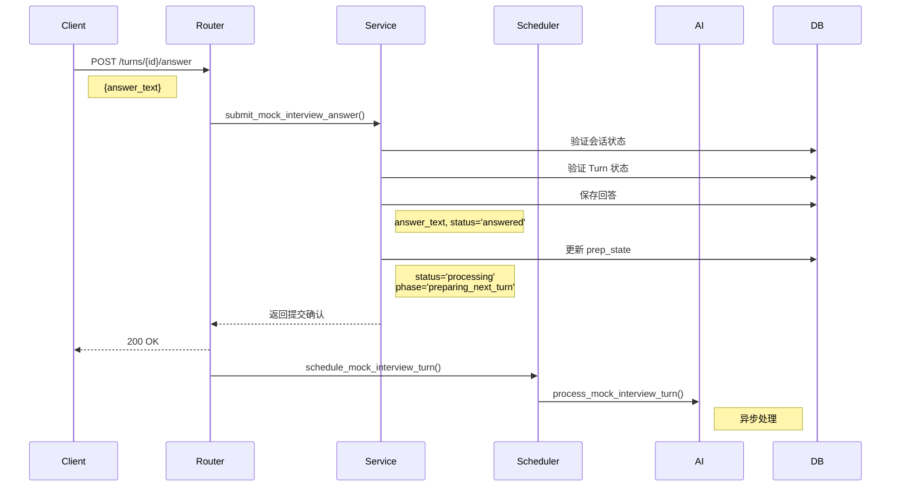
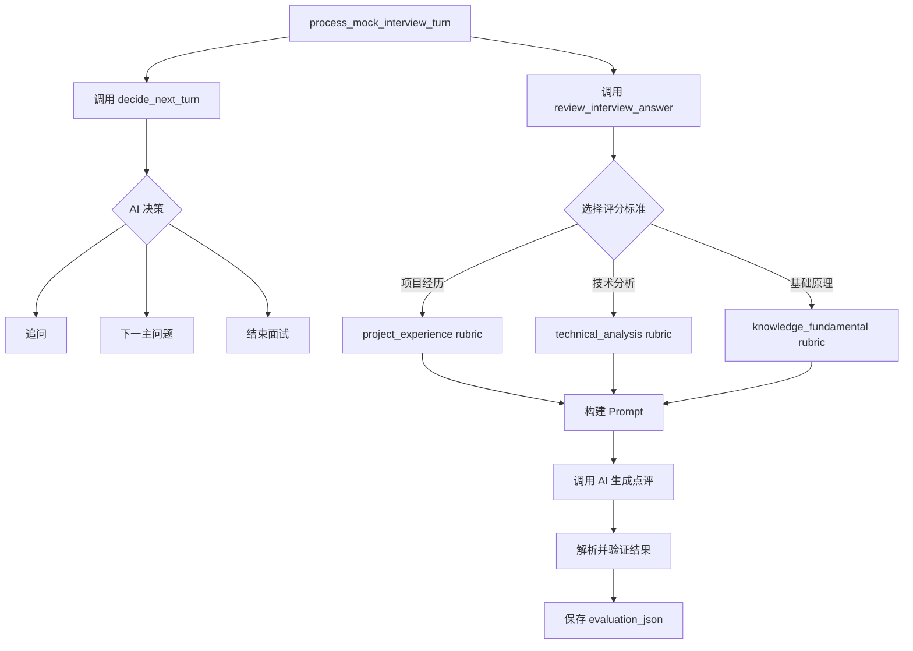
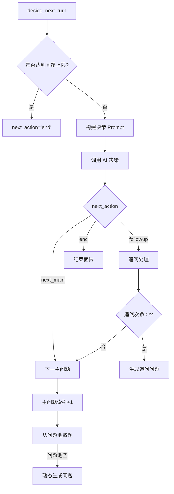
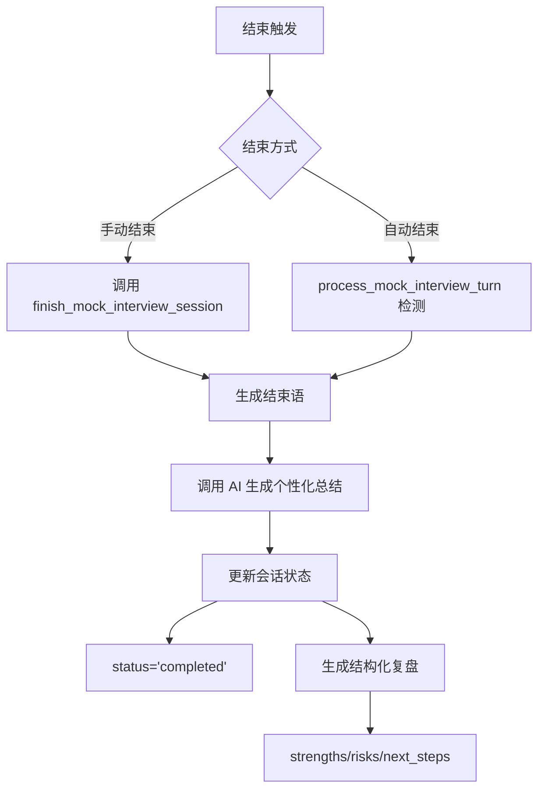

# 模拟面试模块后端设计文档

## 目录

1. [概述](#概述)
2. [架构设计](#架构设计)
3. [核心流程详解](#核心流程详解)
4. [功能点清单](#功能点清单)
5. [API 接口文档](#api-接口文档)
6. [数据模型详解](#数据模型详解)
7. [AI Prompt 设计](#ai-prompt-设计)
8. [配置说明](#配置说明)

---

## 概述

### 模块定位

模拟面试模块是 Career Pilot 核心工作流的重要组成部分，承接简历定制环节，为用户提供基于真实岗位和简历内容的个性化面试训练体验。

### 与整体工作流的关系

```
┌─────────────┐    ┌─────────────┐    ┌─────────────┐    ┌─────────────┐
│  简历上传    │ → │  简历编辑    │ → │  定制简历    │ → │  模拟面试    │
│  & 解析     │    │  & 结构化    │    │  生成       │    │  训练       │
└─────────────┘    └─────────────┘    └─────────────┘    └─────────────┘
                                                           ↑
                                                    复用岗位+简历上下文
```

### 核心特性

| 特性 | 说明 |
|------|------|
| **个性化问题生成** | 基于岗位JD和定制简历生成针对性问题 |
| **深度点评系统** | 每次回答后提供结构化反馈（评分、优缺点、改进建议） |
| **智能追问逻辑** | 根据回答质量决定是否追问或切换下一题 |
| **异步处理** | AI 生成任务异步执行，不阻塞用户操作 |
| **多题型支持** | 项目经历、技术分析、基础原理三类题型 |
| **复盘总结** | 会话结束后生成整体表现分析和建议 |

---

## 架构设计

### 数据模型关系图



### 服务层架构

```
┌─────────────────────────────────────────────────────────────────┐
│                         API Layer                                │
│  ┌──────────────────────────────────────────────────────────┐  │
│  │              mock_interviews.py (Router)                 │  │
│  │  - POST   /mock-interviews                               │  │
│  │  - GET    /mock-interviews                               │  │
│  │  - GET    /mock-interviews/{id}                          │  │
│  │  - POST   /mock-interviews/{id}/turns/{tid}/answer       │  │
│  │  - POST   /mock-interviews/{id}/finish                   │  │
│  │  - POST   /mock-interviews/{id}/retry-prep               │  │
│  │  - POST   /mock-interviews/{id}/events                   │  │
│  │  - DELETE /mock-interviews/{id}                          │  │
│  └──────────────────────────────────────────────────────────┘  │
└─────────────────────────────────────────────────────────────────┘
                              ↓
┌─────────────────────────────────────────────────────────────────┐
│                      Service Layer                               │
│  ┌─────────────────────┐  ┌─────────────────────────────────┐  │
│  │  mock_interview.py  │  │     mock_interview_runtime.py   │  │
│  │                     │  │                                 │  │
│  │ 核心服务逻辑：        │  │ 异步任务调度：                   │  │
│  │ - 会话CRUD          │  │ - schedule_mock_interview_prep  │  │
│  │ - 问题生成          │  │ - schedule_mock_interview_turn  │  │
│  │ - 回答处理          │  │ - 任务去重与生命周期管理          │  │
│  │ - 追问决策          │  │                                 │  │
│  │ - 复盘生成          │  │                                 │  │
│  └─────────────────────┘  └─────────────────────────────────┘  │
│  ┌──────────────────────────────────────────────────────────┐  │
│  │              interview_review.py                         │  │
│  │                                                          │  │
│  │ 深度点评服务：                                            │  │
│  │ - review_interview_answer()                              │  │
│  │ - 基于题型评分标准评估回答                                 │  │
│  └──────────────────────────────────────────────────────────┘  │
└─────────────────────────────────────────────────────────────────┘
                              ↓
┌─────────────────────────────────────────────────────────────────┐
│                      AI Prompt Layer                             │
│  ┌──────────────┐ ┌──────────────┐ ┌──────────────────────────┐ │
│  │ system.txt   │ │ question_    │ │ feedback.txt             │ │
│  │ 面试官角色   │ │ generation   │ │ 追问决策                  │ │
│  │ 定义        │ │ .txt         │ │                          │ │
│  │              │ │ 问题池生成   │ │                          │ │
│  └──────────────┘ └──────────────┘ └──────────────────────────┘ │
│  ┌──────────────────────────────────────────────────────────┐  │
│  │              deep_review_system.txt                      │  │
│  │              deep_review_user.txt                        │  │
│  │              deep_review_rubric_*.txt                    │  │
│  │ 深度点评 Prompt 体系                                      │  │
│  └──────────────────────────────────────────────────────────┘  │
└─────────────────────────────────────────────────────────────────┘
```

---

## 核心流程详解

### 1. 会话创建流程



**关键代码片段：**

```python
# 首题生成逻辑
def _build_first_question(job: JobDescription, workflow: ResumeOptimizationSession) -> MainQuestionPlan:
    job_title = job.title.strip() or "目标岗位"
    if workflow.tailored_resume_md.strip():
        text = f"先请你做一个简短自我介绍，并重点讲一段最能证明你适合"{job_title}"的经历。"
    else:
        text = f"先请你做一个简短自我介绍，并说明你为什么想申请"{job_title}"。"
    return MainQuestionPlan(
        question_id="opening-1",
        category="开场",
        review_type=MockInterviewReviewType.PROJECT_EXPERIENCE,
        text=text,
        intent=f"快速判断候选人与岗位的直接相关性",
        followup_hints=["与岗位最相关的经历", "岗位动机"],
    )
```

### 2. 问题准备流程（异步）



### 3. 答题处理流程



### 4. 深度点评生成流程



**深度点评输出结构：**

```python
class DeepReviewResult(BaseModel):
    status: Literal["pending", "ready", "failed"]
    score: float  # 0-10 分
    level_judgment: InterviewLevelJudgment  # 5级能力判断
    overall_comment: str  # 面试官判断
    strengths: list[str]  # 2-5条答对的点
    weaknesses: list[str]  # 2-6条具体问题
    missing_framework: list[str]  # 缺失的排查框架（技术分析题）
    stronger_answer_outline: list[str]  # 3-7条更强回答骨架
    interviewer_concern: str  # 为什么影响评价
    display_comment: str  # 展示给候选人的点评
```

### 5. 追问/切题决策流程



**决策约束条件：**
- 同一主问题最多追问 2 次
- 总问题数上限 16 个
- 达到上限必须结束

### 6. 会话结束流程



---

## 功能点清单

### 会话管理功能

| 功能 | 描述 | 对应 API |
|------|------|----------|
| 创建会话 | 基于岗位和定制简历创建新会话 | POST /mock-interviews |
| 列会话 | 获取用户的所有会话列表 | GET /mock-interviews |
| 获取详情 | 获取会话完整信息（含所有 Turn） | GET /mock-interviews/{id} |
| 结束会话 | 手动结束进行中的会话 | POST /mock-interviews/{id}/finish |
| 删除会话 | 删除指定会话 | DELETE /mock-interviews/{id} |
| 重试准备 | 重新执行问题池准备任务 | POST /mock-interviews/{id}/retry-prep |
| 记录事件 | 记录客户端事件（如页面退出） | POST /mock-interviews/{id}/events |

### 问题生成功能

| 功能 | 描述 | 触发时机 |
|------|------|----------|
| 首题生成 | 生成自我介绍类开场题 | 会话创建时同步 |
| 问题池生成 | 异步生成12个主问题 | 会话创建后异步 |
| 动态问题生成 | 问题池耗尽时动态生成 | 需要下一题时 |
| 追问生成 | 基于回答生成追问问题 | AI 决策为追问时 |

### 回答提交与处理

| 功能 | 描述 | 关键逻辑 |
|------|------|----------|
| 提交回答 | 保存用户回答文本 | 验证会话和 Turn 状态 |
| 异步处理 | 后台生成点评和下一题 | 不阻塞用户操作 |
| 轮询更新 | 前端轮询获取最新状态 | 每2秒一次 |

### 深度点评系统

| 题型 | 评分维度 | 特殊字段 |
|------|----------|----------|
| 项目经历 | 背景、角色、难点、取舍、量化、owner感 | - |
| 技术分析 | 问题定义、复现思路、排查框架、验证意识 | missing_framework |
| 基础原理 | 概念准确性、原理解释、因果逻辑、实践联系 | - |

### 追问逻辑

```python
# 决策逻辑伪代码
if question_count >= max_total_questions:
    next_action = "end"
elif followup_count < 2 and answer_is_incomplete():
    next_action = "followup"
else:
    next_action = "next_main"
```

### 复盘总结

**结构化复盘包含：**
- **亮点 (strengths)**：已完成至少一轮真实问答
- **风险 (risks)**：部分回答偏短、最新题目未作答等
- **下一步 (next_steps)**：补充指标、规模和个人决策依据

---

## API 接口文档

### 端点列表

| 方法 | 端点 | 描述 | 认证 |
|------|------|------|------|
| POST | `/mock-interviews` | 创建会话 | Bearer Token |
| GET | `/mock-interviews` | 列会话 | Bearer Token |
| GET | `/mock-interviews/{session_id}` | 获取会话详情 | Bearer Token |
| POST | `/mock-interviews/{session_id}/turns/{turn_id}/answer` | 提交回答 | Bearer Token |
| POST | `/mock-interviews/{session_id}/finish` | 结束会话 | Bearer Token |
| POST | `/mock-interviews/{session_id}/retry-prep` | 重试准备 | Bearer Token |
| POST | `/mock-interviews/{session_id}/events` | 记录事件 | Bearer Token |
| DELETE | `/mock-interviews/{session_id}` | 删除会话 | Bearer Token |

### 请求/响应格式

#### 1. 创建会话

**Request:**
```json
POST /mock-interviews
{
  "job_id": "uuid",
  "resume_optimization_session_id": "uuid"
}
```

**Response (201):**
```json
{
  "code": "success",
  "data": {
    "id": "uuid",
    "job_id": "uuid",
    "resume_optimization_session_id": "uuid",
    "status": "active",
    "question_count": 1,
    "max_questions": 16,
    "prep_state": {
      "status": "processing",
      "phase": "preparing_question_pool",
      "message": "首题已生成，正在准备后续题。"
    },
    "current_turn": {
      "id": "uuid",
      "turn_index": 1,
      "question_text": "先请你做一个简短自我介绍...",
      "question_type": "main",
      "review_type": "project_experience"
    },
    "turns": [...],
    "review": {
      "strengths": [],
      "risks": [],
      "next_steps": []
    }
  }
}
```

#### 2. 提交回答

**Request:**
```json
POST /mock-interviews/{session_id}/turns/{turn_id}/answer
{
  "answer_text": "我在上一家公司负责..."
}
```

**Response (200):**
```json
{
  "code": "success",
  "data": {
    "session_id": "uuid",
    "submitted_turn_id": "uuid",
    "next_action": {
      "type": "processing"
    }
  }
}
```

#### 3. 获取会话详情

**Response (200):**
```json
{
  "code": "success",
  "data": {
    "id": "uuid",
    "status": "active",
    "question_count": 3,
    "main_question_index": 2,
    "followup_count_for_current_main": 1,
    "prep_state": {
      "status": "success",
      "phase": "ready",
      "message": "下一轮已准备完成。"
    },
    "current_turn": {
      "id": "uuid",
      "question_text": "你刚才提到架构升级，具体是怎么推进落地的？",
      "question_type": "followup"
    },
    "turns": [
      {
        "id": "uuid",
        "turn_index": 1,
        "question_text": "先请你做一个简短自我介绍...",
        "answer_text": "我叫...",
        "evaluation_json": {
          "status": "ready",
          "score": 7.5,
          "display_comment": "这一题我会给你 7.5/10...",
          "strengths": [...],
          "weaknesses": [...]
        }
      }
    ],
    "review": {
      "strengths": ["已完成至少一轮真实问答..."],
      "risks": ["部分回答偏短..."],
      "next_steps": ["下一轮优先补充指标..."]
    }
  }
}
```

### 状态码说明

| 状态码 | 含义 | 场景 |
|--------|------|------|
| 201 | 创建成功 | 会话创建成功 |
| 200 | 成功 | 其他操作成功 |
| 404 | 未找到 | 会话/岗位/简历不存在 |
| 409 | 冲突 | 会话非活跃状态、重复提交回答、缺少定制简历 |
| 500 | 服务器错误 | AI 调用失败等 |

### 错误处理

**典型错误响应：**
```json
{
  "code": "conflict",
  "message": "Mock interview session is not active"
}
```

```json
{
  "code": "not_found",
  "message": "Mock interview session not found"
}
```

---

## 数据模型详解

### MockInterviewSession（会话）

| 字段 | 类型 | 说明 |
|------|------|------|
| id | UUID | 主键 |
| user_id | UUID | 用户ID（外键） |
| resume_id | UUID | 简历ID（外键） |
| jd_id | UUID | 岗位ID（外键） |
| match_report_id | UUID | 匹配报告ID（外键） |
| optimization_session_id | UUID | 定制简历会话ID（外键） |
| source_resume_version | int | 源简历版本 |
| source_job_version | int | 源岗位版本 |
| mode | string | 模式（默认 'general'） |
| status | string | 状态：active/completed/failed |
| current_question_index | int | 当前问题索引 |
| current_follow_up_count | int | 当前追问次数 |
| max_questions | int | 最大问题数（默认16） |
| max_follow_ups_per_question | int | 每问题最大追问数（默认2） |
| plan_json | JSON | 计划数据（含问题池、准备状态等） |
| review_json | JSON | 复盘数据 |
| overall_score | decimal | 总体评分 |
| error_message | text | 错误信息 |

**plan_json 结构：**
```json
{
  "role_summary": "岗位摘要",
  "resume_summary": "候选人画像",
  "candidate_profile": "综合画像",
  "main_questions": [...],
  "main_question_index": 0,
  "followup_count_for_current_main": 0,
  "current_question": "当前问题文本",
  "current_question_type": "main",
  "current_main_question_id": "q1",
  "current_review_type": "project_experience",
  "queued_followup_question": null,
  "ending_text": null,
  "prep_state": {
    "status": "success",
    "phase": "ready",
    "message": "..."
  },
  "events": [...]
}
```

### MockInterviewTurn（问答轮次）

| 字段 | 类型 | 说明 |
|------|------|------|
| id | UUID | 主键 |
| session_id | UUID | 会话ID（外键） |
| turn_index | int | 轮次索引（从1开始） |
| question_group_index | int | 问题分组索引 |
| question_source | string | 来源：main/follow_up |
| review_type | string | 评审类型 |
| question_topic | string | 问题主题ID |
| question_text | text | 问题文本 |
| question_intent | text | 问题意图 |
| question_rubric_json | JSON | 评分标准 |
| answer_text | text | 回答文本 |
| answer_latency_seconds | int | 回答耗时（秒） |
| status | string | 状态：asked/answered |
| evaluation_json | JSON | 深度点评结果 |
| decision_json | JSON | AI 决策结果 |
| asked_at | datetime | 提问时间 |
| answered_at | datetime | 回答时间 |
| evaluated_at | datetime | 评价时间 |

**evaluation_json 结构（深度点评）：**
```json
{
  "status": "ready",
  "score": 7.5,
  "level_judgment": "basically_good_but_not_strong_enough",
  "overall_comment": "方向是对的，但回答还不够成体系。",
  "strengths": ["方向正确", "有结构意识"],
  "weaknesses": ["排查维度不完整", "过快归因"],
  "missing_framework": ["数据输入", "通信与 overlap"],
  "stronger_answer_outline": [
    "先定义问题现象",
    "再做对照实验",
    "最后验证优化收益"
  ],
  "interviewer_concern": "像能参与排查，但还不足以独立主导。",
  "display_comment": "这一题我会给你 7.5/10。方向是对的，但还不够成体系。"
}
```

**decision_json 结构（AI 决策）：**
```json
{
  "need_comment": false,
  "comment_text": "",
  "next_action": "followup",
  "next_question": "你刚才提到架构升级，具体是怎么推进落地的？",
  "reason": "probe execution details"
}
```

### 评审类型

```python
class MockInterviewReviewType(str, Enum):
    PROJECT_EXPERIENCE = "project_experience"      # 项目经历
    TECHNICAL_ANALYSIS = "technical_analysis"    # 技术分析/排查
    KNOWLEDGE_FUNDAMENTAL = "knowledge_fundamental"  # 基础原理
```

### 面试官能力等级

```python
class InterviewLevelJudgment(str, Enum):
    INCORRECT_OR_INSUFFICIENT = "incorrect_or_insufficient"
    DIRECTIONALLY_CORRECT_BUT_NOT_SYSTEMATIC = "directionally_correct_but_not_systematic"
    BASICALLY_GOOD_BUT_NOT_STRONG_ENOUGH = "basically_good_but_not_strong_enough"
    STRONG_AND_STRUCTURED = "strong_and_structured"
    EXCELLENT_AND_OWNER_LIKE = "excellent_and_owner_like"
```

---

## AI Prompt 设计

### Prompt 文件清单

| 文件名 | 用途 | AI 调用场景 |
|--------|------|-------------|
| `system.txt` | 面试官角色定义 | 所有 AI 调用 |
| `role_summary.txt` | 岗位摘要提取 | 问题池准备阶段 |
| `resume_summary.txt` | 候选人画像提取 | 问题池准备阶段 |
| `question_generation.txt` | 生成12个主问题 | 问题池准备阶段 |
| `feedback.txt` | 追问/切题决策 | 每次回答后 |
| `dynamic_question.txt` | 动态生成补充问题 | 问题池耗尽时 |
| `recap.txt` | 结束语生成 | 会话结束时 |
| `deep_review_system.txt` | 深度点评系统指令 | 每次回答后 |
| `deep_review_user.txt` | 深度点评输入模板 | 每次回答后 |
| `deep_review_rubric_*.txt` | 各题型评分标准 | 每次回答后 |

### 面试官系统 Prompt

```
你是一名专业，自然、正式的中文面试官。

任务是基于候选人的目标岗位描述和优化后的简历内容，发起一场模拟面试。

行为规则：
1. 总提问预算固定，系统会告诉你还剩多少次提问。
2. 每次只能输出一个问题。
3. 允许在提问前给出一句非常短的点评，但点评不是必须的。
4. 点评必须简短，自然、不过度教学。
5. 对同一个主问题，最多追问 2 次。
6. 若候选人的回答已经足够完整，就切换到下一个主问题。
7. 问题必须贴近岗位描述和简历内容。
8. 不要输出多个并列问题。
9. 不要输出长段分析。
10. 不要输出总结报告。
11. 语气保持真实面试风格，默认正式但不过度施压。
12. 如果信息不足，也不要抱怨输入格式，而是基于已有内容尽量生成合理问题。
```

### 问题生成 Prompt

```
你要生成一场模拟面试的主问题池。

输入信息：
- 岗位摘要：{role_summary}
- 候选人画像：{candidate_profile}

要求：
1. 生成 12 个主问题。
2. 问题要尽量覆盖：
   - 自我介绍/求职动机
   - 项目经历
   - 岗位核心能力
   - 技术/业务理解
   - 协作沟通/行为面
3. 问题必须贴合岗位摘要和候选人画像。
4. 每个问题都要尽量具体，避免空泛。
5. 每题只问一个点。
6. 每题附带：
   - question_id
   - category
   - review_type（只能是 technical_analysis / project_experience / knowledge_fundamental）
   - text
   - intent
   - followup_hints（给出1~3个可能追问方向）
7. 输出 JSON 数组，不要输出额外说明。
```

### 追问决策 Prompt

```
你正在进行一场模拟面试。

输入信息：
- 岗位摘要：{role_summary}
- 候选人画像：{candidate_profile}
- 当前主问题：{current_main_question}
- 当前问题：{current_question}
- 当前问题类型：{current_question_type}
- 当前主问题下已追问次数：{followup_count_for_current_main}
- 当前总提问次数：{question_count}
- 最大提问次数：{max_total_questions}
- 最近对话：{recent_turns}
- 候选人本轮回答：{candidate_answer}

请你判断：
1. 是否需要一句短点评
2. 下一步是追问、切换到下一个主问题，还是结束
3. 如果追问或切到下一个主问题，请给出下一个问题

强约束：
1. 点评不是必须的；若给点评，必须非常短。
2. 同一主问题最多追问 2 次。
3. 问题必须具体，只问一个点。
4. 如果总提问次数已经达到上限，则 next_action 必须为 "end"。
5. 不要输出总结报告。
6. 输出必须是 JSON 对象。
```

### 深度点评 System Prompt

```
你是一名经验丰富的一线技术面试官。

你的任务不是安慰候选人，而是判断这段回答是否足以让你相信候选人能独立接手问题。

要求：
1. 优先评价回答的成熟度、结构化程度、覆盖维度和独立推进能力。
2. 不要使用"总体不错""继续加油""还可以更好"这类空话。
3. 必须先识别答对的部分，再指出真正的问题。
4. 必须解释为什么这些问题会影响面试官评价。
5. 输出必须是合法 JSON，不能输出 markdown，不能输出额外解释。

评分规则：
- 5 分以下：关键理解不足，答案散乱，明显不成立。
- 6~7 分：方向对，但不体系化，不足以体现独立推进能力。
- 8 分：结构完整，维度较全，体现排查与验证思路。
- 9 分以上：像成熟工程师，知道如何快速收敛问题并解释取舍。
```

### 题型评分标准

#### 项目经历 rubric

```
本题型是项目经历类题目，请重点判断：
1. 是否讲清项目背景。
2. 是否讲清个人角色与贡献。
3. 是否讲清关键难点。
4. 是否体现技术或业务取舍。
5. 是否有结果量化。
6. 是否体现 owner 感。

如果回答空泛，请优先指出"贡献模糊、难点不清、结果不硬"。
```

#### 技术分析 rubric

```
本题型是技术分析/性能排查/故障定位类题目，请重点判断：
1. 是否有清晰的问题定义。
2. 是否有最小化复现或对照思路。
3. 是否有分层排查框架。
4. 是否避免过快归因。
5. 是否有验证和回归意识。
6. 是否体现工程 owner 感。

如果回答方向对但缺少结构，请优先判断为"会但不成体系"，并列出候选人缺失的排查维度。
```

#### 基础原理 rubric

```
本题型是技术基础/原理解释类题目，请重点判断：
1. 概念是否正确。
2. 原理解释是否清晰。
3. 是否有因果逻辑。
4. 是否能结合实践场景。
5. 是否存在只背定义、不懂落地的情况。

如果回答停留在术语层面，请优先指出"知道概念，但解释不到位或缺乏落地理解"。
```

---

## 配置说明

### AI 提供商配置

模拟面试模块支持多种 AI 提供商，通过环境变量配置：

```bash
# AI 提供商类型：openai / ollama / codex2gpt 等
INTERVIEW_AI_PROVIDER=ollama

# API Base URL
INTERVIEW_AI_BASE_URL=http://127.0.0.1:11434

# API Key（部分提供商可为空）
INTERVIEW_AI_API_KEY=

# 默认模型
INTERVIEW_AI_MODEL=qwen2.5:7b

# 规划模型（用于问题生成等一次性任务）
INTERVIEW_AI_MODEL_PLANNING=qwen2.5:7b

# 实时模型（用于追问决策等需要快速响应的任务）
INTERVIEW_AI_MODEL_REALTIME=qwen2.5:7b

# 超时时间（秒）
INTERVIEW_AI_TIMEOUT_SECONDS=60
```

### 模型选择策略

| 任务类型 | 推荐模型 | 配置项 |
|----------|----------|--------|
| 问题池生成 | 支持长上下文的大模型 | `INTERVIEW_AI_MODEL_PLANNING` |
| 岗位/简历摘要 | 支持长上下文的大模型 | `INTERVIEW_AI_MODEL_PLANNING` |
| 追问决策 | 响应速度快的模型 | `INTERVIEW_AI_MODEL_REALTIME` |
| 深度点评 | 支持结构化输出的模型 | `INTERVIEW_AI_MODEL_REALTIME` |
| 结束语生成 | 支持对话风格的模型 | `INTERVIEW_AI_MODEL_REALTIME` |

### 本地 Ollama 配置示例

```bash
# 启动 Ollama 服务
ollama serve

# 拉取模型
ollama pull qwen2.5:7b

# 环境变量配置
export INTERVIEW_AI_PROVIDER=ollama
export INTERVIEW_AI_BASE_URL=http://127.0.0.1:11434
export INTERVIEW_AI_MODEL=qwen2.5:7b
export INTERVIEW_AI_MODEL_PLANNING=qwen2.5:7b
export INTERVIEW_AI_MODEL_REALTIME=qwen2.5:7b
```

---

## 文件结构

```
apps/backend/app/
├── routers/
│   └── mock_interviews.py          # API 路由定义
├── services/
│   ├── mock_interview.py           # 核心服务逻辑
│   ├── mock_interview_runtime.py   # 异步任务调度
│   └── interview_review.py         # 深度点评服务
├── schemas/
│   ├── mock_interview.py           # Pydantic Schema
│   └── interview_review.py         # 评审相关 Schema
├── models/
│   └── mock_interview.py           # SQLAlchemy 模型
└── prompts/
    └── mock_interview/
        ├── system.txt              # 面试官角色定义
        ├── role_summary.txt        # 岗位摘要 Prompt
        ├── resume_summary.txt      # 候选人画像 Prompt
        ├── question_generation.txt # 问题池生成 Prompt
        ├── feedback.txt            # 追问决策 Prompt
        ├── dynamic_question.txt    # 动态问题 Prompt
        ├── recap.txt               # 结束语 Prompt
        ├── deep_review_system.txt  # 深度点评系统 Prompt
        ├── deep_review_user.txt   # 深度点评输入 Prompt
        ├── deep_review_rubric_project_experience.txt
        ├── deep_review_rubric_technical_analysis.txt
        └── deep_review_rubric_knowledge_fundamental.txt
```

---

## 相关文档

- [Resume Pipeline](../docs/domain/resume-pipeline.md) - 主简历工作流
- [Domain Entities](../docs/domain/entities.md) - 核心实体定义
- [System Map](../docs/architecture/system-map.md) - 系统架构总览
- [Frontend Interview Page](../apps/frontend/src/app/(dashboard)/dashboard/interviews/page.tsx) - 前端实现
